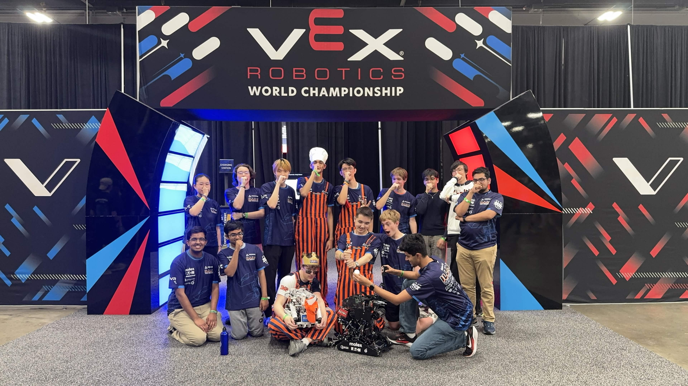

# Illini VEX Robotics

**UIUC's Competitive Vex U Organization**

---

## About

This organization hosts the code behind our robots and our internal tooling, and serves as a means to enable effective and efficient collaboration between members of the ILLINI Vex Robotics Prog Team. Everything here is written and maintained by students, who learn the fundamentals of C++ and Git through their involvement and contributions.

## Projects

Over the course of the 2026-2027 Vex U Override Season, our Prog team will write driver control and autonomous routines for ILLIN1. Our main technical goal is to implement **Monte Carlo Localization**, fusing three sources of
position data:

- **Odometry** — tracking wheel encoders for dead reckoning
- **Distance sensors** — field wall references to correct drift
- **Computer vision** — April tag reading for global position recovery

We aim to write a well documented, clean, and easily extensible codebase that will benefit this and other organizations in future seasons.

## Contact

Email us at <vexuiuc@gmail.com>, or join our [Discord](https://discord.gg/xVKPX6h6aS).

---

University of Illinois Urbana-Champaign · VEX U Teams ILLIN1 and ILLIN2

